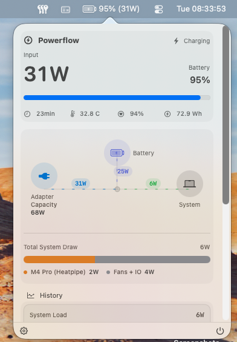
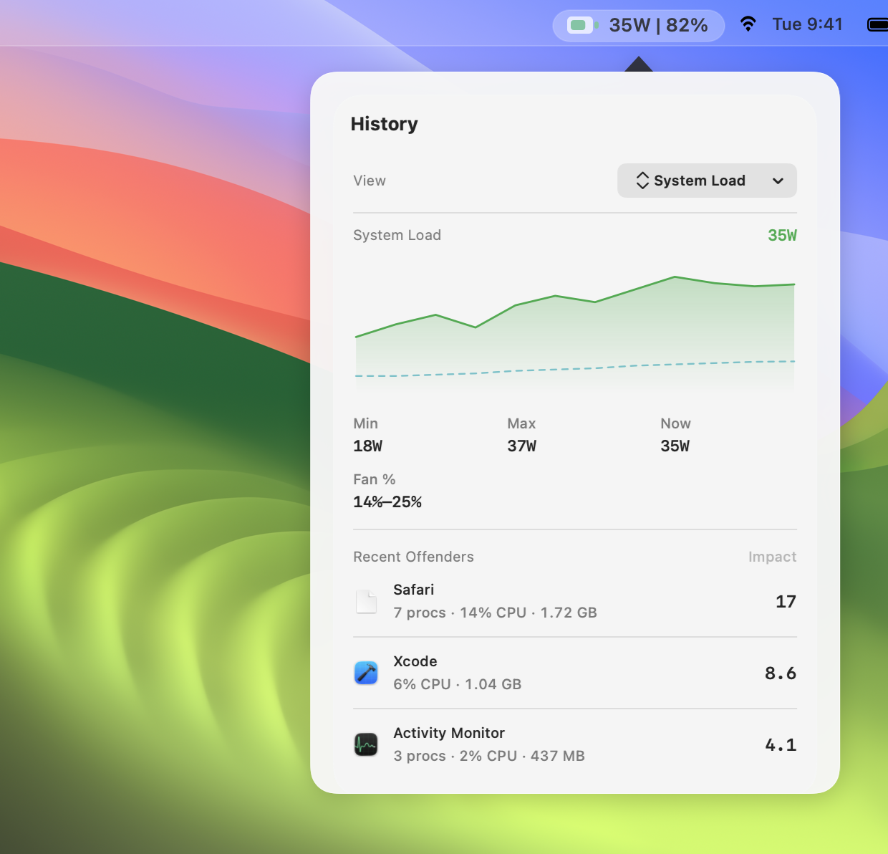
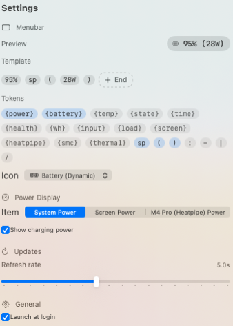

# Powerflow

Powerflow is a native macOS menu bar app for monitoring adapter input, system load,
battery state, and thermal behavior in real time. The app is intentionally OS-first:
Powerflow observes and explains battery health, while macOS remains the source of truth
for charge optimization and battery longevity controls.

Fork reference: https://github.com/lzt1008/powerflow

## Screenshots



 

## Features

- Menu bar power readout with customizable format and icon.
- Live power flow diagram (adapter, system, battery).
- System load breakdown based on SMC total and known channels.
- Battery health, remaining Wh, cycle count, and temperature visibility.
- History charts for system load and primary temperature.
- Battery guidance links to Apple's built-in battery management documentation.
- Diagnostics view for SMC/IORegistry/telemetry data and fan readings.

## Privacy

Powerflow runs locally and does not include network, analytics, or updater code. The
Recent Offenders section samples local process activity to identify apps with notable
CPU, memory, and paging activity; this can be disabled in Settings.

## Requirements

- macOS 15+
- Xcode 16.4 or newer
- Xcode 27 beta for macOS 27 SDK validation

## Build and Run

Open the Xcode project:

```
open Powerflow.xcodeproj
```

Run the tests:

```
xcodebuild -project Powerflow.xcodeproj -scheme Powerflow -destination "platform=macOS" test
```

Validate against the macOS 27 SDK with Xcode beta:

```
DEVELOPER_DIR=/Applications/Xcode-beta.app/Contents/Developer xcodebuild -project Powerflow.xcodeproj -scheme Powerflow -destination "platform=macOS" test
```

Repo scripts also accept either `POWERFLOW_USE_XCODE_BETA=1` or
`POWERFLOW_DEVELOPER_DIR=/path/to/Xcode.app/Contents/Developer`.

Update the recorded layout snapshots:

```
scripts/update_layout_snapshots.sh
```

Verify the recorded layout snapshots:

```
scripts/verify_layout_snapshots.sh
```

Regenerate the README screenshot assets:

```
scripts/regenerate_assets.sh
```

Build a release app:

```
xcodebuild -project Powerflow.xcodeproj -scheme Powerflow -configuration Release -destination "platform=macOS" build
```

There is also a release packaging script:

```
scripts/build_release.sh
```

## Repository Layout

- `Sources/Powerflow` - App source, including services, state, and SwiftUI UI.
- `Tests/PowerflowTests` - Unit tests for settings and formatting behavior.
- `Resources` - App resources and Info.plist.
- `project.yml` - XcodeGen project definition.
- `scripts/build_release.sh` - Release packaging script.
- `LICENSE` - Original MIT license.

## License

MIT. See `LICENSE`.
