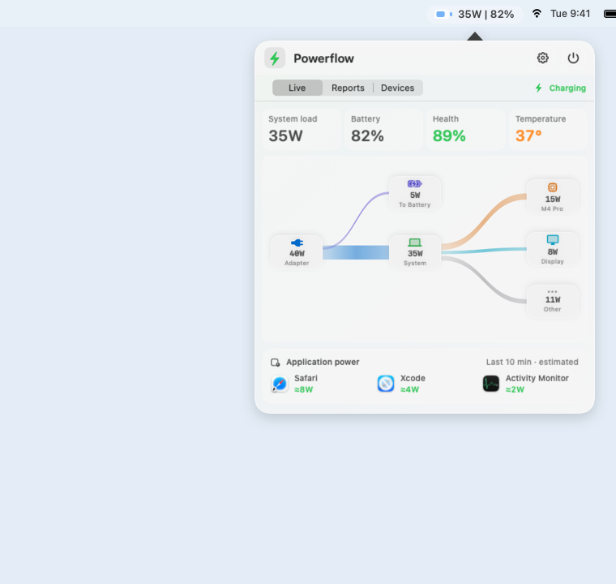
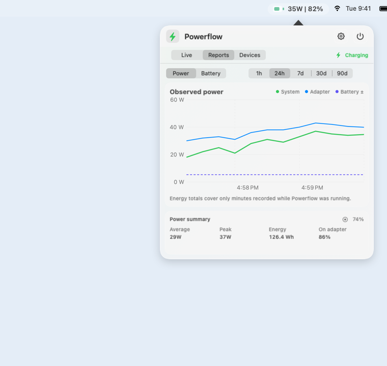
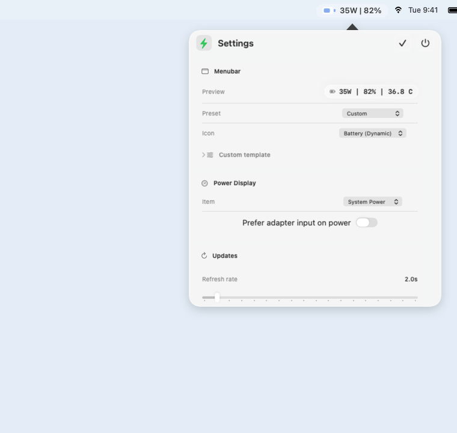

# Powerflow

Powerflow is a native macOS menu bar app for monitoring adapter input, system load,
battery state, and thermal behavior in real time. The app is intentionally OS-first:
Powerflow observes and explains battery health, while macOS remains the source of truth
for charge optimization and battery longevity controls.

Fork reference: https://github.com/lzt1008/powerflow

## Screenshots







## Features

- Menu bar power readout with customizable format and icon.
- Live Sankey power flow for adapter, battery, system, package, display, and derived remainder load.
- Persistent local power and battery reports with 1-hour through 90-day ranges.
- Observed energy, adapter-time, temperature, capacity-health, and cycle-count trends.
- Battery health, remaining Wh, cycle count, and temperature visibility.
- Rolling ten-minute application-energy estimate using duration-integrated power budgets.
- Battery guidance links to Apple's built-in battery management documentation.
- Diagnostics view for SMC/IORegistry/telemetry data and fan readings.

## Privacy

Powerflow runs locally and does not include network, analytics, or updater code.
Reports store numeric one-minute power and battery summaries in Application Support;
they do not store process, device, account, hostname, or hardware-serial identifiers.

Application-energy attribution samples local CPU time and paging activity. To make the
rolling ten-minute view survive an app restart, Powerflow keeps a private cache containing
only timestamps, interval energy, bundle identifiers, app display names, active duration,
and peak estimated power. It omits PIDs, executable paths, memory figures, paging figures,
and non-bundle process names. Turning off **Track application energy** stops sampling and
deletes that cache. Connected-device data is read only while the Devices tab is selected
and is never persisted.

Application energy is an activity-weighted estimate, not measured per-app watts.
It integrates package power where available, otherwise system power minus display
power. The system energy counter is used for system reports, not as a replacement
for package energy. Intervals spanning a change of attribution source are omitted.
GPU, media-engine, network, and other activity cannot be attributed precisely from
CPU and paging counters. Report coverage excludes intervals with unavailable
system-power telemetry. Corrupt history files are preserved in a `corrupt-*`
folder beside the replacement database.

## Requirements

- macOS 15+
- Xcode 16.4 or newer
- Xcode 27 beta for macOS 27 SDK validation

## Build and Run

Open the Xcode project:

```
open Powerflow.xcodeproj
```

Run the tests:

```
xcodebuild -project Powerflow.xcodeproj -scheme Powerflow -destination "platform=macOS" test
```

Validate against the macOS 27 SDK with Xcode beta:

```
DEVELOPER_DIR=/Applications/Xcode-beta.app/Contents/Developer xcodebuild -project Powerflow.xcodeproj -scheme Powerflow -destination "platform=macOS" test
```

Repo scripts also accept either `POWERFLOW_USE_XCODE_BETA=1` or
`POWERFLOW_DEVELOPER_DIR=/path/to/Xcode.app/Contents/Developer`.

Update the recorded layout snapshots:

```
scripts/update_layout_snapshots.sh
```

Verify the recorded layout snapshots:

```
scripts/verify_layout_snapshots.sh
```

Layout snapshots fix the window backing scale to 2× and pin locale, time zone,
and overlay scrollbars within the test process. Record and verify with the same
macOS/Xcode version; existing baselines were verified with Xcode 27.0 beta
(`27A5209h`). The error-report fixture also checks that saved data remains visibly
marked when a refresh fails.

Regenerate the README screenshot assets:

```
scripts/regenerate_assets.sh
```

Build a release app:

```
xcodebuild -project Powerflow.xcodeproj -scheme Powerflow -configuration Release -destination "platform=macOS" build
```

There is also a release packaging script:

```
scripts/build_release.sh
```

## Repository Layout

- `Sources/Powerflow` - App source, including services, state, and SwiftUI UI.
- `Tests/PowerflowTests` - Unit tests for settings and formatting behavior.
- `Resources` - App resources and Info.plist.
- `project.yml` - XcodeGen project definition.
- `scripts/build_release.sh` - Release packaging script.
- `LICENSE` - Original MIT license.

## License

MIT. See `LICENSE`.
